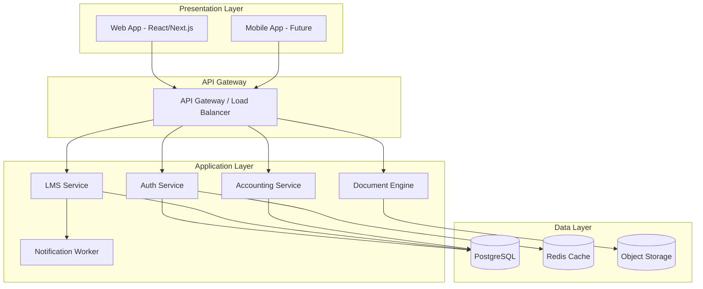

# High-Level Architecture Document

**Project:** MFI & SACCO SaaS Platform  
**Version:** 1.0.0

---

## 1. System Architecture Overview

The platform follows a **4-Layer Architecture** with clear separation of concerns.



---

## 2. Technology Stack

| Layer | Technology | Justification |
| :--- | :--- | :--- |
| **Frontend** | Next.js + TypeScript | SSR, SEO, type safety |
| **Backend** | Django + DRF | Rapid dev, strong ORM, multi-tenancy support |
| **Database** | PostgreSQL 15 | Schema-per-tenant, JSONB, extensions |
| **Cache** | Redis | Session storage, rate limiting |
| **Queue** | Celery + Redis | Async jobs (SMS, PDF, Accounting) |
| **Storage** | MinIO / S3 | Document storage |
| **Auth** | JWT + OAuth2 | Stateless, scalable |

---

## 3. Module Boundaries

```
┌─────────────────────────────────────────────────────┐
│                    BACKEND MONOLITH                 │
├─────────────────────────────────────────────────────┤
│  /apps                                              │
│  ├── tenants/       # Multi-tenancy, Subscriptions  │
│  ├── users/         # IAM, Roles, Permissions       │
│  ├── clients/       # Member/Customer Management    │
│  ├── loans/         # Core LMS Engine               │
│  ├── collateral/    # Asset & Guarantee Tracking    │
│  ├── accounting/    # Double-Entry Ledger           │
│  ├── documents/     # Template Engine, PDF Gen      │
│  ├── communications/# SMS, Email Workers            │
│  └── mis/           # Reporting & Dashboards        │
└─────────────────────────────────────────────────────┘
```

---

## 4. Communication Patterns

| Pattern | Use Case |
| :--- | :--- |
| **Sync REST** | CRUD operations, loan applications |
| **Async Celery** | PDF generation, SMS, Accounting postings |
| **Django Signals** | Internal event propagation (LMS → Accounting) |

---

## 5. Scalability Considerations
- **Horizontal:** Stateless API servers behind a load balancer.
- **Database:** Read replicas for reporting queries.
- **Tenant Isolation:** Schema-per-tenant ensures logical isolation with single DB instance (simpler ops).
