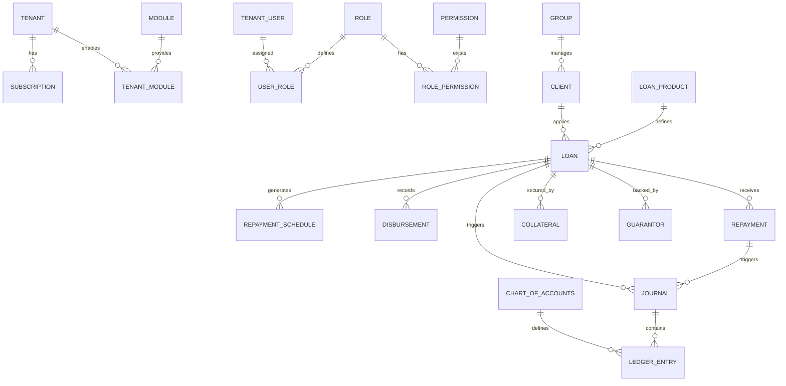

# Domain-Level Database Design (ERD)

This document outlines the core database architecture for the **MFI & SACCO SaaS Platform**.

## 1. Multi-Tenancy Strategy
We are adopting a **Schema-per-Tenant** approach. 
- **Public Schema:** Contains platform-level data (Tenants, Subscriptions, Global Config).
- **Tenant Schemas:** Each institution has an isolated schema containing their specific financial data.

---

## 2. Entity Relationship Diagram

---

## 3. Core Module Schemas

### A. SaaS Foundation (Public)
| Table | Description |
| :--- | :--- |
| `tenants` | Institutional profiles (Name, KRA PIN, Contact). |
| `subscriptions` | Active plans, billing cycles, expiry dates. |
| `modules` | Registry of available modules (LMS, Payroll, etc). |

### B. Identity & Access Management (IAM)
| Table | Description |
| :--- | :--- |
| `users` | Staff accounts with branch-level scoping. |
| `roles` | Enterprise roles (Loan Officer, Branch Manager). |
| `permissions` | Granular CRUD+Authorize permissions. |
| `audit_logs` | Immutable records of every state change. |

### C. Loan Management System (LMS)
| Table | Description |
| :--- | :--- |
| `clients` | Member/Customer profiles (KYC data). |
| `loan_products` | Templates (Interest rates, terms, penalties). |
| `loans` | The core contract instance. |
| `repayment_schedule` | Amortization table (Principal, Interest, Date). |

### D. Automated Accounting (Double-Entry)
| Table | Description |
| :--- | :--- |
| `chart_of_accounts` | Ledger accounts (Assets, Liabilities, Equity, etc). |
| `journals` | Logical grouping of a single transaction. |
| `ledger_entries` | Atomic Debits and Credits. |

---

## 4. Key Relationships & Constraints
1. **Hard Isolation:** All tenant-specific tables reside in the institutional schema.
2. **Auditability:** Every financial record must link to a `journal_id` for traceability.
3. **Workflow State:** Loans utilize a `status` field transitionable only via approved workflows.
