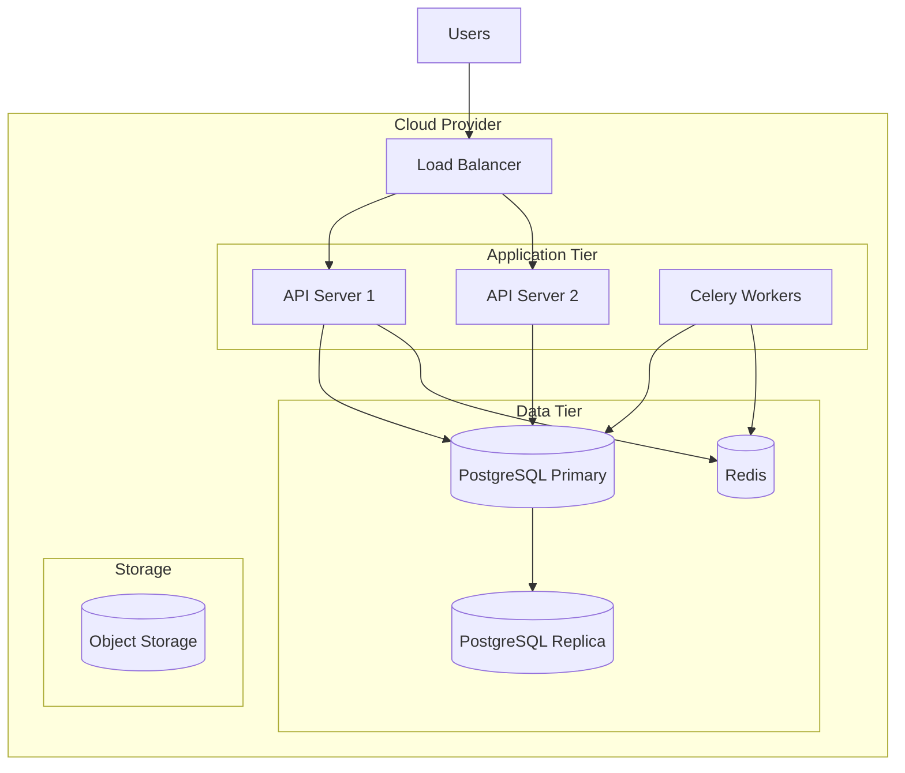
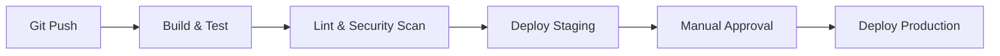

# Deployment Architecture

**Project:** MFI & SACCO SaaS Platform

---

## 1. Infrastructure Overview



---

## 2. Environments

| Environment | Purpose | Infrastructure |
| :--- | :--- | :--- |
| **Development** | Local dev | Docker Compose |
| **Staging** | QA/Testing | Single server |
| **Production** | Live system | HA cluster |

---

## 3. CI/CD Pipeline



### Pipeline Steps
1. **Build:** Docker image creation
2. **Test:** Unit + Integration tests
3. **Lint:** Code quality + SAST scan
4. **Stage:** Auto-deploy to staging
5. **Prod:** Manual gate, blue-green deploy

---

## 4. Docker Services

```yaml
# docker-compose.yml (simplified)
services:
  api:
    image: lms-backend:latest
    ports: ["8000:8000"]
    depends_on: [db, redis]
    
  worker:
    image: lms-backend:latest
    command: celery -A core worker
    
  db:
    image: postgres:15
    volumes: [pgdata:/var/lib/postgresql/data]
    
  redis:
    image: redis:7-alpine
```

---

## 5. Backup & Recovery

| Component | Strategy | Frequency |
| :--- | :--- | :--- |
| **Database** | pg_dump + WAL archiving | Daily + Continuous |
| **Documents** | S3 versioning | On write |
| **Config** | Git-tracked | On change |

### Recovery Targets
- **RPO:** 1 hour (max data loss)
- **RTO:** 4 hours (max downtime)

---

## 6. Monitoring & Alerting

| Tool | Purpose |
| :--- | :--- |
| **Prometheus** | Metrics collection |
| **Grafana** | Dashboards |
| **Sentry** | Error tracking |
| **PagerDuty** | Incident alerting |
