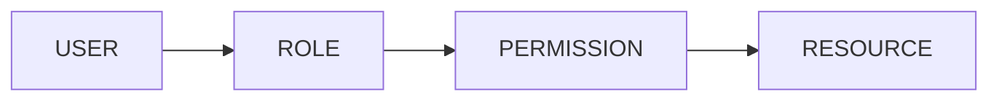

# Security Design Document

**Project:** MFI & SACCO SaaS Platform

---

## 1. Security Principles
1. **Defense in Depth:** Multiple layers of protection.
2. **Least Privilege:** Users get only necessary permissions.
3. **Auditability:** Every action is logged.

---

## 2. Authentication

| Mechanism | Implementation |
| :--- | :--- |
| **Primary** | JWT (Access + Refresh tokens) |
| **MFA** | TOTP for admin roles (Phase 2) |
| **Session** | Stateless; tokens stored client-side |

### Token Lifecycle
- Access Token: 15 minutes
- Refresh Token: 7 days (rotated on use)

---

## 3. Authorization (RBAC)

### Permission Format
`{module}.{action}` — e.g., `loans.approve`, `accounting.post`

### Approval Limits
| Role | Max Approval (KES) |
| :--- | :--- |
| Loan Officer | 0 (Cannot approve) |
| Branch Manager | 500,000 |
| Head Office | Unlimited |

---

## 4. Data Protection

| Domain | Control |
| :--- | :--- |
| **In Transit** | TLS 1.3 (HTTPS enforced) |
| **At Rest** | AES-256 encryption (PostgreSQL TDE) |
| **Backups** | Encrypted, off-site, daily |
| **PII** | Masked in logs; access-controlled |

---

## 5. Tenant Isolation
- **Schema-per-Tenant:** Each institution's data resides in a separate PostgreSQL schema.
- **Middleware:** Every request is scoped to the authenticated tenant.
- **Hard Rule:** Cross-tenant queries are architecturally impossible.

---

## 6. Audit Logging
Every state-changing action logs:
- `user_id`
- `action` (CREATE, UPDATE, DELETE)
- `resource` (e.g., `loans`, `clients`)
- `before_state` / `after_state` (JSON diff)
- `timestamp`
- `ip_address`

---

## 7. Compliance
| Regulation | Approach |
| :--- | :--- |
| **Kenya Data Protection Act** | Consent management, data minimization |
| **SASRA Guidelines** | Reporting formats, retention policies |
