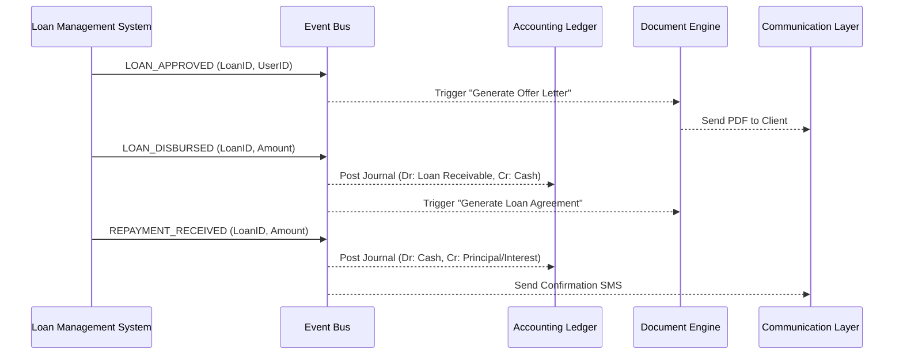

# Event-Driven Workflows

This document defines how the system modules (LMS, Accounting, Documents) interact through events.

---

## 1. High-Level Event Flow

The LMS is the **Event Producer**. The Accounting and Document engines are **Event Consumers**.

---

## 2. Specific Event Definitions

### A. Loan Application & Appraisal
| Event | Trigger | Action (Accounting) | Action (Documents) |
| :--- | :--- | :--- | :--- |
| `APPLICATION_SUBMITTED` | User submits form | N/A | Generate "Application Form" |
| `LOAN_APPROVED` | Manager approves | N/A | Generate "Offer Letter" |

### B. Disbursement (The Contract phase)
| Event | Trigger | Action (Accounting) | Action (Documents) |
| :--- | :--- | :--- | :--- |
| `LOAN_DISBURSED` | Funds released | **Debit** Loan Portfolio   **Credit** Cash/Bank | Generate "Loan Agreement"   Generate "Repayment Schedule" |

### C. Repayment & Maintenance
| Event | Trigger | Action (Accounting) | Action (Documents) |
| :--- | :--- | :--- | :--- |
| `REPAYMENT_POSTED` | M-Pesa/Cash received | **Debit** Cash/Bank   **Credit** Loan Receivable | Generate "Payment Receipt" |
| `INTEREST_ACCRUED` | EOD Process | **Debit** Loan Receivable   **Credit** Interest Income | N/A |
| `LOAN_DEFAULTED` | PAR > Threshold | **Debit** Provision Expense   **Credit** Loan Allowance | Generate "Demand Notice" |

---

## 3. Implementation Guardrails
1. **Idempotency:** Every event MUST have a unique `event_uuid`. The Accounting system must ensure it never posts the same event twice.
2. **Atomic Transfers:** Accounting journals must be balanced (Sum of Debits = Sum of Credits) before saving.
3. **Template Versioning:** Documents generated for a specific loan must use the template version active at the time of the event.
4. **Asynchronous Processing:** Documents and SMS alerts should be handled by background workers to avoid slowing down the LMS core.
